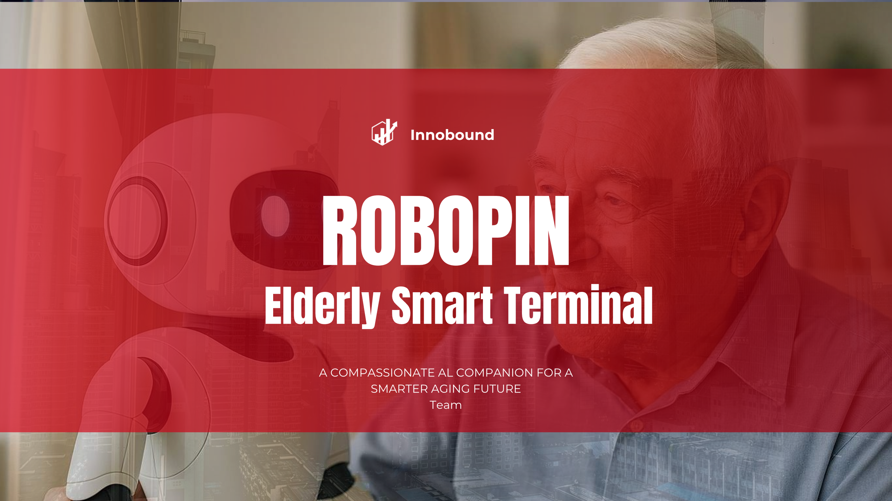

# Robopin 的官方 Next.js 前端项目

## 项目介绍

**本项目是一个基于 Next.js App Router v15+ 和 TypeScript 的前端项目，由 Innobound 团队出品，这是一个致力于“老有所依”的智能陪伴团队**。



## 技术栈设计

- Node.js (运行时环境) [Node.js — Run JavaScript Everywhere](https://nodejs.org/en)
- TypeScript (编程语言) [TypeScript - JavaScript With Syntax For Types](https://www.typescriptlang.org/)
- Next.js (框架) [Next.js by Vercel - The React Framework](https://nextjs.org/)
- React.js (底层框架) [React - The library for web and native user interfaces](https://react.dev/)
- Tailwind CSS (样式库) [Tailwind CSS - Rapidly build modern websites without ever leaving your HTML](https://tailwindcss.com/)

## 开发者指引

### 环境要求

- Node.js (>= 22.x)
- NPM (>= 11.x)

### 本地开发

1. 克隆项目到本地：

   ```bash
   $ git clone https://github.com/SunriseXuu/robopin-next.git
   $ cd robopin-next
   ```

2. 安装项目所需要的依赖：

   ```bash
   $ npm install
   ```

3. 启动 dev 服务器：

   ```bash
   $ npm run dev
   ```

   启动后，可以通过 `http://localhost:3000` 访问页面。

4. 构建 prod 并运行：

   ```bash
   $ npm run build
   $ npm start
   ```

   启动后，可以通过 `http://localhost:3000` 访问页面。
